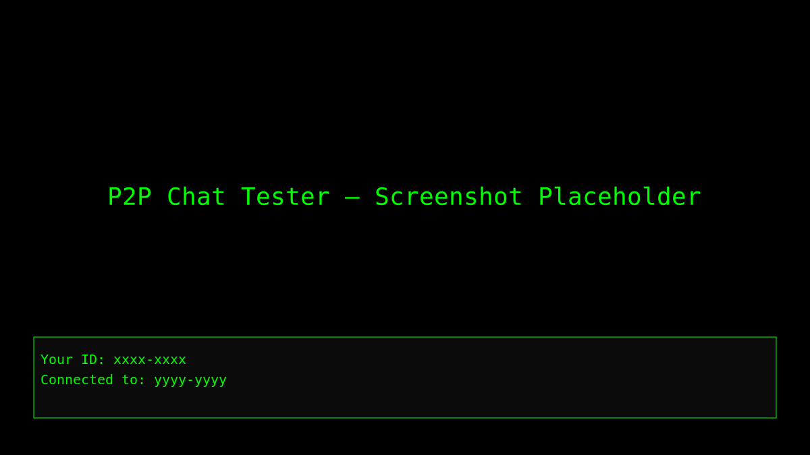

# P2P-Chat-Tester-Peerjs

A minimal peer-to-peer (P2P) chat tester built with PeerJS and plain HTML/JavaScript. This repository contains a simple front-end (HTML/CSS/JS) to test P2P connections and messaging between browser peers.

## Features

- Establish P2P connections using PeerJS
- Send and receive text messages between peers
- Simple, dependency-free HTML demo (no build step required)

## Prerequisites

- A modern web browser (Chrome, Firefox, Edge)  
- (Optional) A local web server to serve files (recommended for some browser security restrictions). For quick testing you can use Python's simple server:

  - Python 3: `python -m http.server 8000`  
  - Then open `http://localhost:8000` in your browser

## Usage

1. Clone or download this repository to your machine.  
2. Serve the files with a local web server or open the `index.html` file directly in your browser.  
3. Open the demo in two browser windows or on two devices. Each instance will have a PeerJS-generated ID.  
4. Enter the remote peer's ID and connect. Once connected you can exchange text messages.

### Quick example

- In terminal: `python -m http.server 8000`  
- Open `http://localhost:8000` in two browser windows/tabs  
- Each page displays "Your ID:" — copy one ID into the other's "Enter remote peer ID" box and press Connect  
- Type messages and press Send (or Enter)

## Demo & Screenshots

Below are placeholders that already exist in the repository. They will render when the files are present:

How to add your own images:

- Create or replace files under `assets/`:
  - `assets/screenshot.png` or `.svg` — a static screenshot of the UI (recommended size: 800×450 or 1200×675)
  - `assets/demo.gif` or `.svg` — a short animated GIF or animated SVG demonstrating a connection and messages

Example (Linux/macOS):
- Record a GIF or make a PNG and move it into `assets/`:
  - `git add assets/screenshot.png assets/demo.gif && git commit -m "Add demo assets" && git push`

## GitHub Pages (optional)

If you want a hosted live demo, enable GitHub Pages for this repository (Settings → Pages) and point it to the `main` branch (root). Once Pages is enabled, the site will be available at:
`https://<your-username>.github.io/P2P-Chat-Tester-Peerj/` and will serve the `index.html` demo page.

Notes:
- GitHub Pages may take a minute to build and serve the site.
- If you want, I can add an automated deployment workflow later.

## File structure

- `index.html` — Main demo page with chat UI and PeerJS integration  
- `peerjs.min.js` — PeerJS client library included for convenience  
- `README.md` — This file  
- `assets/` — screenshots and demo SVG/GIFs

## Contributing

Contributions and improvements are welcome. Open an issue or submit a pull request with your changes.

## License

This project is provided under the MIT License. See the LICENSE file for details.
